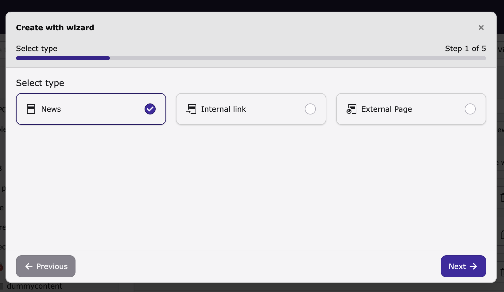
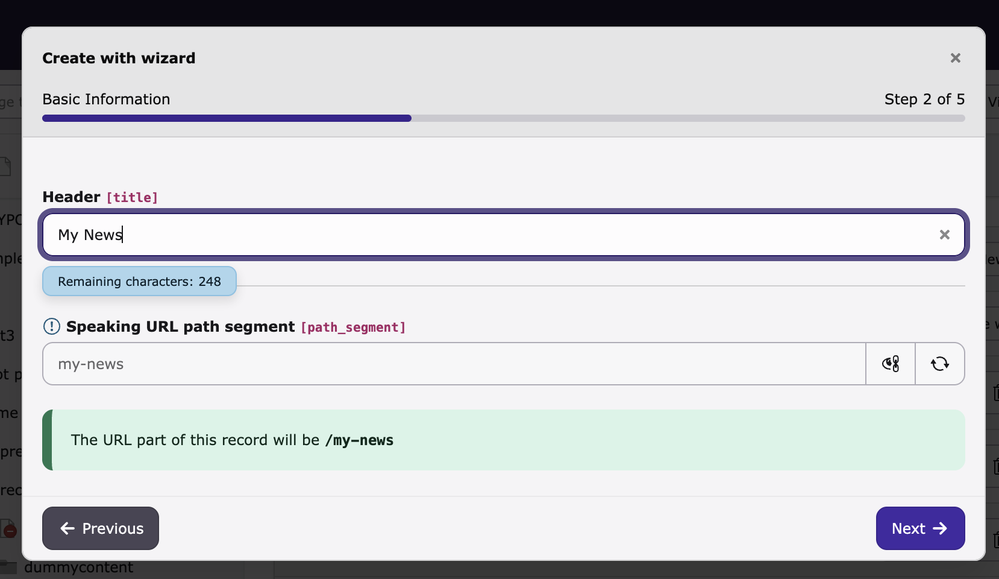

# EXT:record_wizard

Brings the guided step-by-step creation wizard — known from the TYPO3 page creation dialog — to arbitrary records in the backend list module.




## Requirements

- TYPO3 14 LTS

## Installation

Install via Composer:

```bash
composer require georgringer/record-wizard
```

After installation, go to **Admin Tools → Settings → Extension Configuration** and add the tables you want to enable the wizard for:

```
wizardTables = tx_news_domain_model_news
```

Multiple tables are separated by commas.

## Adding wizard steps to a table

Define `wizardSteps` inside each TCA type you want to support. The wizard auto-detects which types are available and offers a type selector when more than one type has steps defined.

```php
// e.g. in EXT:my_ext/Configuration/TCA/tx_myext_domain_model_item.php
'types' => [
    '0' => [
        'wizardSteps' => [
            'basics' => [
                'title' => 'Basic Information',
                'fields' => ['title', 'slug', 'date'],
            ],
            'details' => [
                'title' => 'Details',
                'fields' => ['description', 'bodytext'],
                'after' => ['basics'],
            ],
        ],
        'showitem' => '...',
    ],
],
```

Each step requires:
- `title` — shown as the step label (LLL references are supported)
- `fields` — list of TCA column names shown on that step

The optional `after` key defines ordering between steps.
